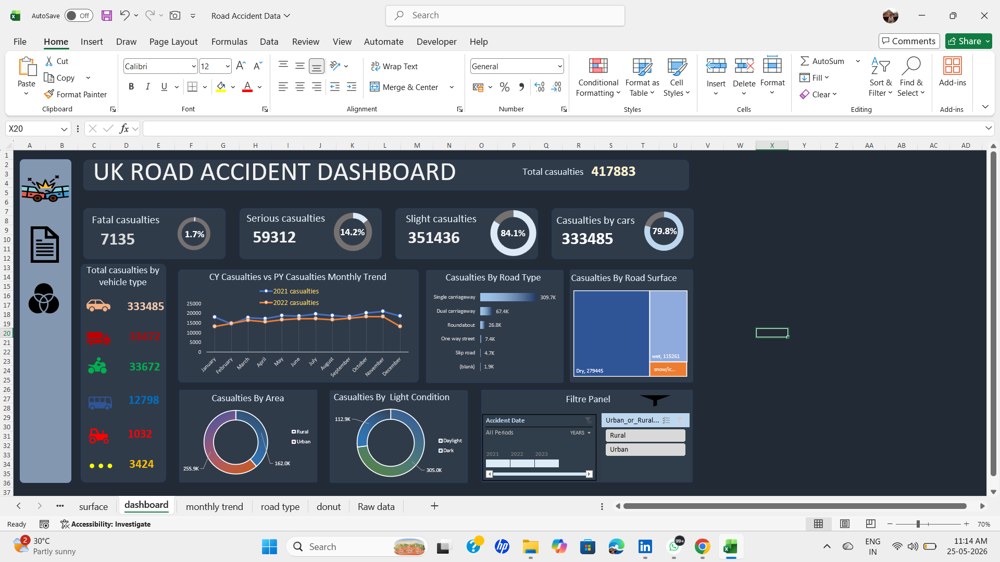

# 🚗 Road Accident Dashboard - End-to-End Data Analysis Project

This project focuses on building an interactive Road Accident Dashboard 
using Microsoft Excel. It involves the complete data analysis lifecycle — 
from data cleaning and transformation to exploratory data analysis (EDA) 
and visualization.

## 📌 Project Workflow

Data ➡️ Excel ➡️ Data Cleaning & Preparation ➡️ EDA ➡️ Interactive Dashboard

## 📊 Dataset Information

* Number of Records: 417,883
* Time Period: 2021 – 2022
* Region: United Kingdom
* Stored in: Microsoft Excel

## 🔧 Steps Involved

### 1. Data Cleaning & Preparation

* Removed duplicate and inconsistent records from raw dataset.
* Standardized categorical variables like Road Type, Surface, and Light Conditions.
* Created calculated columns for Year and Month to enable trend analysis.
* Classified accident severity into three bands:
  * `Fatal`
  * `Serious`
  * `Slight`

### 2. Exploratory Data Analysis (EDA)

* Categorical analysis on:
  * Vehicle Type
  * Road Type
  * Road Surface Condition
  * Light Conditions (Daylight vs Dark)
  * Urban vs Rural Area
* Numerical analysis on:
  * Total Casualties
  * Fatal, Serious, and Slight Casualties
  * Monthly Casualty Trends (2021 vs 2022)

### 3. Key Insights from EDA

* **Cars** account for **79.8%** of all casualties.
* **Single carriageway** roads are the most dangerous road type.
* **Dry road surfaces** recorded the highest number of accidents.
* Accidents **reduced in 2022** compared to 2021.
* **Daylight** conditions account for more accidents than darkness.

## 📈 Dashboard Sections (Excel)

1. KPI Summary Cards
2. Monthly Trend Analysis
3. Road Type Breakdown
4. Surface & Light Condition Analysis
5. Urban vs Rural Comparison

## 🚀 Tools & Technologies

* Data Storage: Microsoft Excel
* Visualization: Excel Charts & KPI Cards
* Techniques: Pivot Tables, Conditional Formatting, Dynamic Charts

## 🧠 Learnings

* Data wrangling and cleaning in Excel
* Building KPI cards and dynamic charts
* Year-over-year trend comparison
* Deriving actionable insights through EDA
* Designing a professional single-page dashboard

## ✅ Dashboard Overview

### ✅ KPI Cards
Total casualties, fatal, serious, and slight accident counts at a glance.

### ✅ Monthly Trend
Year-over-year comparison of accident counts for 2021 and 2022.

### ✅ Road Type Analysis
Breakdown of casualties by road category — single carriageway, 
dual carriageway, roundabout, and more.

### ✅ Surface & Conditions
Analysis of accidents by road surface condition and light conditions.

### ✅ Urban vs Rural
Comparison of accident distribution across urban and rural areas.

## 📸 Dashboard Preview

## 🎥 Demo Video

[▶️ Click here to watch the Dashboard Demo](Excel/Excel%20project.mp4)
